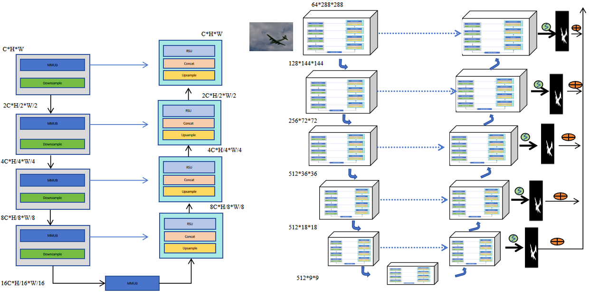
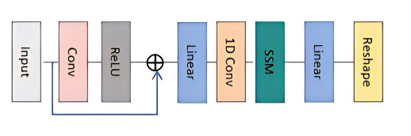

# U²-Net with Mamba Integration 🐍

[](https://www.python.org/)
[](https://pytorch.org/)
[](https://opensource.org/licenses/MIT)

This repository contains the training code for an enhanced **U²-Net** model integrated with **Mamba (State Space Model)** layers, specifically designed for high-performance Salient Object Detection (SOD) tasks.

---

## 📖 Overview

This project implements a hybrid architecture that synergizes the multi-scale feature extraction capabilities of **U²-Net** with the efficient long-range dependency modeling of **Mamba**:

* **U²-Net:** Utilizes nested U-structures to capture fine-grained spatial details.
* **Mamba Layer:** Replaces standard bottlenecks with Selective State Space Models (SSM) to achieve global context awareness with linear $O(L)$ complexity.

---

## 🛠️ Requirements

The environment is optimized for **Python 3.10** and **CUDA 11.8+**.

```bash
### Install core dependencies
pip install torch torchvision torchmetrics numpy mamba-ssm
```
---

## 📊 Dataset Preparation
The pipeline is pre-configured for the DUTS dataset. Please organize your data as follows:
```bash
train_data/
└── DUTS-TR/
    └── DUTS-TR/
        ├── im_aug/    # Training images (.jpg)
        └── gt_aug/    # Corresponding ground truth masks (.png)
```
---

## 🏗️ Model Architecture
The primary innovation is the MambaLayer integration, which processes spatial data as follows:
1. Normalization: Applies LayerNorm for gradient stability.
2. Serialization: Flattens 2D feature maps $\in \mathbb{R}^{C \times H \times W}$ into 1D sequences.
3. SSM Modeling: Learns global topological relationships via Mamba kernels.




---

## 🚀 Training Instructions
1. Clone the Repository
git clone [https://github.com/your-username/u2net-mamba.git](https://github.com/your-username/u2net-mamba.git)
cd u2net-mamba

2. Run Training
Adjust hyperparameters in u2mamba_train.py (e.g., epoch_num, batch_size_train) as needed, then execute:
python u2mamba_train.py

---

## 📊 Performance Comparison

Comparison of our method and SOTA methods on baseline datasets:

## 📊 Quantitative Comparison

Comparison with State-of-the-Art (SOTA) methods.
**Metrics:** $S_m \uparrow$ / $F_{\beta}^{max} \uparrow$ / $E_m^{max} \uparrow$ / $MAE \downarrow$

## 📊 Quantitative Comparison

We evaluate our method against State-of-the-Art (SOTA) models across five benchmark datasets. 
**Metrics Key:** $S_m \uparrow$ / $F_{\beta}^{max} \uparrow$ / $E_m^{max} \uparrow$ / $MAE \downarrow$

| Model | DUTS-TE | PASCAL | DUT-OMRON | HKU-IS | ECSSD |
| :--- | :---: | :---: | :---: | :---: | :---: |
| **F3Net** | .888 / .840 / .901 / .035 | .861 / .840 / .889 / .062 | .825 / .766 / .844 / .053 | .917 / .910 / .942 / .028 | .924 / .925 / .945 / .033 |
| **RCSB** | .885 / .855 / .898 / .034 | .863 / .842 / .891 / .058 | .821 / .773 / .840 / .045 | .921 / .923 / .945 / .027 | .915 / .823 / .910 / .033 |
| **U²Net** | .894 / .873 / .910 / .044 | .822 / .770 / .855 / .076 | .848 / .823 / .872 / .054 | .929 / .935 / .954 / .031 | .941 / .951 / .965 / .033 |
| **MSENet** | .892 / .877 / .911 / .034 | .875 / .862 / .902 / .060 | .838 / .798 / .865 / .045 | .925 / .927 / .948 / .026 | .943 / .941 / .961 / .033 |
| **LDF** | .890 / .855 / .905 / .034 | .870 / .848 / .899 / .060 | .832 / .773 / .860 / .051 | .920 / .914 / .944 / .027 | .935 / .930 / .955 / .034 |
| **PoolNet**| .875 / .809 / .885 / .040 | .855 / .822 / .881 / .074 | .815 / .747 / .835 / .056 | .910 / .899 / .932 / .032 | .921 / .915 / .939 / .039 |
| **BBRF** | .901 / .905 / .920 / .040 | .889 / .884 / .915 / .074 | .845 / .820 / .875 / .056 | .938 / .946 / .959 / .032 | .949 / .957 / .970 / .039 |
| **MENet** | .904 / .895 / .924 / .028 | .872 / .848 / .905 / .062 | .841 / .792 / .869 / .045 | .940 / .939 / .963 / .023 | .945 / .938 / .962 / .031 |
| **VST** | .896 / .877 / .915 / .037 | .868 / .850 / .895 / .067 | .835 / .800 / .862 / .058 | .931 / .937 / .956 / .030 | .940 / .944 / .961 / .034 |
| **VST-S++**| .908 / .897 / .929 / .029 | .880 / .859 / .912 / .062 | .849 / .813 / .878 / .050 | .943 / .941 / .968 / .025 | .952 / .951 / .974 / .027 |
| **Samba** | .902 / .891 / .922 / .030 | .875 / .852 / .904 / .065 | .840 / .805 / .871 / .053 | .938 / .935 / .961 / .028 | .947 / .945 / .969 / .029 |
| **MambaSOD**| .905 / .899 / .926 / .028 | .878 / .855 / .909 / .063 | .845 / .811 / .875 / .051 | .941 / .938 / .965 / .026 | .950 / .949 / .971 / .027 |
| **U²Mamba**| **.915 / .904 / .938 / .024** | **.885 / .856 / .918 / .068** | **.855 / .816 / .886 / .052** | **.948 / .933 / .972 / .025** | **.958 / .929 / .979 / .024** |

---

## 📊 Experimental Results


